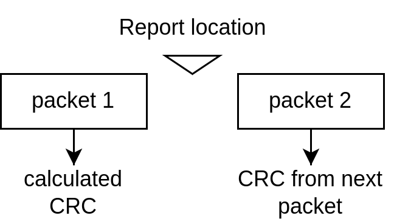
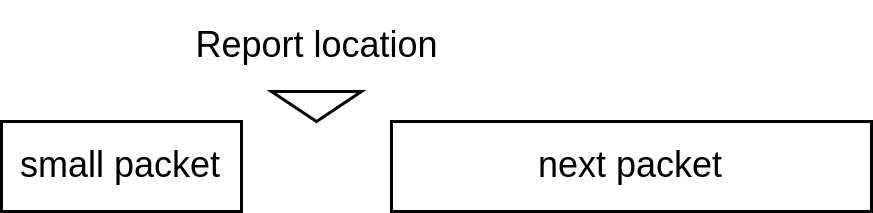

# gtm_decode
a WIP gtm decoder

README version: 20220525
## Compile from source
### Linux
Install `git` and `gcc` from system's package manager. This program also use `argp`, which morden linux installed by default.

```
git clone git@github.com:iiiian/gtm_decode.git
cd gtm_decode
gcc *.c -o gtm_decoder -O3 
```
### Windows
first install cygwin 64, tick the devel package during the install (Remember to add C:\cygwin64\bin to your path). Then clone the respository. if you have already install git, open the command prompt.
```
git clone git@github.com:iiiian/gtm_decode.git
```
Or you can go to the respository and download the zip file.
In the command prompt, goes to the folder gtm_docode, then link `argp` library and compile
```
gcc *.c -o gtm_decoder -IC:\cygwin64\usr\include -LC:\cygwin64\usr\lib -largp -O3
```
## Use
```
GTM decoder -- decode GTM binary file to human readable data
tips:use --help flag to see how to use

Usage: gtm_decoder [OPTION...] use --help flag to see more detail
GTM decoder -- decode GTM binary file to human readable data

  -b, --buffer-size=Bytes    The max buffer size while loading the binary file.
                             The defalt size is 1 GB
  -e, --export-mode=Num      the export mode, for deocde mode 0 only. 0 =
                             output raw format, 1 = output pipeline format, 2 =
                             output both, default 0
      --get-nohit-event      output zero hit event adc, only affect science
                             data(decode mode 0)
  -i, --input=FILE           Required!!, The input binary file
  -m, --decode-mode=Num      Required!!, the decode mode, 0 = decode science
                             data, 1 = decode telemetry data, 2 = extract
                             science data
  -o, --output=FILE          Required!!, The output filename prefix
  -s, --silent               no log and error message
  -t, --terminal-out         deocder will ignore output file and dump all the
                             results into terminal
  -?, --help                 Give this help list
      --usage                Give a short usage message
  -v, --version              show program version

Mandatory or optional arguments to long options are also mandatory or optional
for any corresponding short options.

```

- input file, output file and decode mode is required.
- `--get-nohit-event` will significantly slow down the program!!
- buffer size should not be too small, probably larger than 1 MB will be fine.

## Warning/Error message
During the decoding, there might be warning/error message. 

- **Message: [some message]**
  
  a normal message
- **Error: [some message]**
  
  will terminate the program

Here will document the common warning message and error.

### General

- **Error: can't parse [some variable]**
  
  some of the command line input is unexpected or missing.
- **Error: unknown [decode/export] mode**
  
  the command line input of decode/export mode is uexpected.
- **Error: fail to create [some name] buffer**
  
  error occur when allocating memory, maybe the memory left isn't enough. You could modified the buffer size.
- **Error: Your computer use big endian format, which is not supported by the program!!**
  
  the CPU architecture is not compatible with this program
- **Error: binary file not found**
  
  the input binary file path is missing or wrong.


### Decode mode 0


- **Message: Non continuous occurs around bytes**

  For multiple reason, non continuous packet occurred, it will report the byte location. This warning is triggered by other types of warning, and is used to report the location of those error. Follow is the list of warning that will trigger non continuous warning:
  
  - Wrong CRC
  - Packet size smaller than expected
  - Packet size smaller than expected
  - sequence count not continuous
- **Message: Binary file doesn't start with science data header**

  The input binary file doesn't start with science data header, it will report the byte location where the first header occurs. If this value is too big, you might want to inspect the data. 
- **Message: Can't find next sd header while this isn't the last packet**

  there's no next science data header even if there's enough space. The binary data after this warning wil be discarded.
- **Message: Wrong CRC**

  the CRC byte calculated is different from CRC byte from the next science packet header. It will set non continuous packet warning, and report CRC value. The location reported by the next non continuous warning is at the start of the packet after the non continuous one.
  
- **Message: Packet size smaller than expected**

  the science data packet length is smaller than expected, it will report the number of bytes smaller and set  non continuous packet warning. The location reported by the next non continuous warning is at the start of the packet after the small packet.
  
- **Message: Packet size larger than expected**

  the science data packet length is larger than expected, it will report the number of bytes larger and set  non continuous packet warning. The location reported by the next non continuous warning is at the start of the packet after the large packet.
  
- **Message: sequence count not continuous**

  the sequence count between current and the next science packet is not continuous. It will report both sequence count and set non continuous packet warning. The location reported by the next non continuous warning is at the middle of 2 packets.

  
- **ERROR: Bin file doesn't start with sd header**

  this means something wrong happens when loading new chunk of binary buffer, you should inspect the source code and debug.

### Decode mode 1

- **Message: tmtc tail missing!!**

  No tmtc tail

### Decode mode 2
- **Message: Not NSPO header**
  
  NSPO header does not appear in location they should appear, that means the NSPO packet might be defected.
## Output file
### Decode mode 0
Depends on export mode, there might be prefix_science_raw.txt, prefix_science_raw_sync.csv, prefix_science_pipeline.txt and prefix_science_pipeline_pos.txt
#### **prefix_science_raw.txt**
```
sd header: [sequence number]
sync: [pps count] [cmd sequence number]
event time: [fine count]
event adc: [if hit] [pps count] [fine count] [gtm module] [citiroc id] [channel id] [gain] [adc value]
```
gtm module: 0=master, 1=slave
citiroc id: 0=a, 1=b
gain: 0=LG, 1=HG

#### **prefix_science_raw_sync.csv**
a csv file with header
```
gtm module;PPS counts;CMD-SAD sequence number;UTC day;UTC hour;UTC minute;UTC sec;UTC subsec;x position;y position;z position;x velocity;y velocity;z velocity;S/C Quaternion 1;S/C Quaternion 2;S/C Quaternion 3;S/C Quaternion 4

```
#### **prefix_science_pipeline.txt**
the first line will contain start time.
```
start time UTC,DD_MM_YY_HH_mm_sec
```
where sec is a floating point number.

then there will be a csv table in format:
```
time;detector;channel id;energy
```

where:

- time: sec away from start time

- detector: based on gtm module, citiroc id, and channel id.


| detector | GTM module | citiroc id | channel |
| -------- | ---------- | ---------- | ------- |
| PN       | master     | 0 (A)      | 0 – 15  |
| PB       | master     | 0 (A)      | 16 – 31 |
| PT       | master     | 1 (B)      | 0 – 15  |
| PP       | master     | 1 (B)      | 16 – 31 |
| NP       | slave      | 0 (A)      | 0 – 15  |
| NB       | slave      | 0 (A)      | 16 – 31 |
| NT       | slave      | 1 (B)      | 0 – 15  |
| NN       | slave      | 1 (B)      | 16 – 31 |

- channel id: is related to pixel position.
- energy: in keV
- detector_name: the name of detector
#### **prefix_science_pipeline_pos.txt**
the first line will contain start time.
```
start time UTC,DD_MM_YY_HH_mm_sec
```
where sec is a floating point number.

then there will be a csv table in format:
```
time;qw;qx;qy;qz;ECIx;ECIy;ECIz
```
### Decode mode 1
There will be prefix_tmtc.csv

It's a csv file seperated by `;` with the following column.

```
head;gtm module;Packet Counter;year;day;hour;minute;sec;Lastest PPS Counter;Lastest Fine Time Counter Value Between 2 PPS;Board Temperature#1;Board Temperature#2;CITIROC1 Temperature#1;CITIROC1 Temperature#2;CITIROC2 Temperature#1;CITIROC2 Temperature#2;CITIROC1 Live time;CITIROC2 Live time;CITIROC1 Hit Counter#0;CITIROC1 Hit Counter#1;CITIROC1 Hit Counter#2;CITIROC1 Hit Counter#3;CITIROC1 Hit Counter#4;CITIROC1 Hit Counter#5;CITIROC1 Hit Counter#6;CITIROC1 Hit Counter#7;CITIROC1 Hit Counter#8;CITIROC1 Hit Counter#9;CITIROC1 Hit Counter#10;CITIROC1 Hit Counter#11;CITIROC1 Hit Counter#12;CITIROC1 Hit Counter#13;CITIROC1 Hit Counter#14;CITIROC1 Hit Counter#15;CITIROC1 Hit Counter#16;CITIROC1 Hit Counter#17;CITIROC1 Hit Counter#18;CITIROC1 Hit Counter#19;CITIROC1 Hit Counter#20;CITIROC1 Hit Counter#21;CITIROC1 Hit Counter#22;CITIROC1 Hit Counter#23;CITIROC1 Hit Counter#24;CITIROC1 Hit Counter#25;CITIROC1 Hit Counter#26;CITIROC1 Hit Counter#27;CITIROC1 Hit Counter#28;CITIROC1 Hit Counter#29;CITIROC1 Hit Counter#30;CITIROC1 Hit Counter#31;CITIROC2 Hit Counter#0;CITIROC2 Hit Counter#1;CITIROC2 Hit Counter#2;CITIROC2 Hit Counter#3;CITIROC2 Hit Counter#4;CITIROC2 Hit Counter#5;CITIROC2 Hit Counter#6;CITIROC2 Hit Counter#7;CITIROC2 Hit Counter#8;CITIROC2 Hit Counter#9;CITIROC2 Hit Counter#10;CITIROC2 Hit Counter#11;CITIROC2 Hit Counter#12;CITIROC2 Hit Counter#13;CITIROC2 Hit Counter#14;CITIROC2 Hit Counter#15;CITIROC2 Hit Counter#16;CITIROC2 Hit Counter#17;CITIROC2 Hit Counter#18;CITIROC2 Hit Counter#19;CITIROC2 Hit Counter#20;CITIROC2 Hit Counter#21;CITIROC2 Hit Counter#22;CITIROC2 Hit Counter#23;CITIROC2 Hit Counter#24;CITIROC2 Hit Counter#25;CITIROC2 Hit Counter#26;CITIROC2 Hit Counter#27;CITIROC2 Hit Counter#28;CITIROC2 Hit Counter#29;CITIROC2 Hit Counter#30;CITIROC2 Hit Counter#31;CITIROC1 Trigger counter;CITIROC2 Trigger counter;Counter period Setting;HV DAC1;HV DAC2;SPW#A Error count;SPW#B Error count;SPW#A Last Recv Byte;SPW#B Last Recv Byte;SPW#A status;SPW#B status;Recv Checksum of Last CMD;Calc Checksum of Last CMD;Number of Recv CMDs;SEU-Measurement#1;SEU-Measurement#2;SEU-Measurement#3;checksum;tail
```
### Decode mode 2
There will be prefix_extracted.bin.

Inside is a binary file contain only pure science data, no NSPO wrapping.
